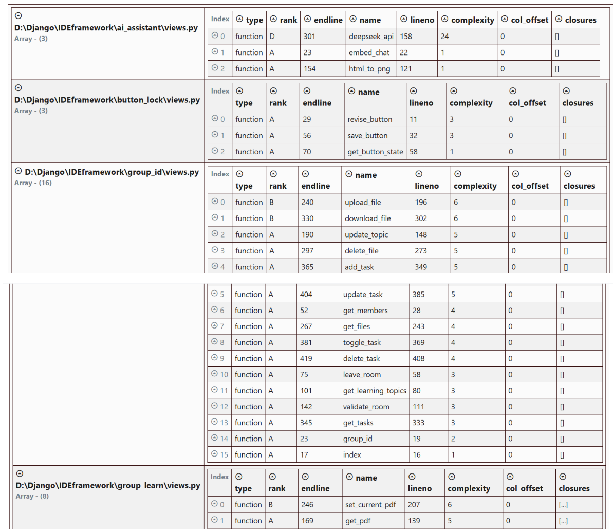
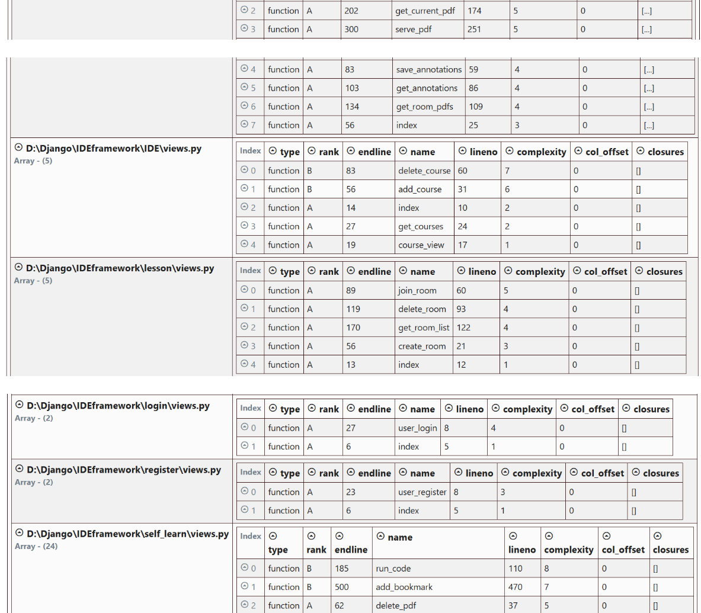
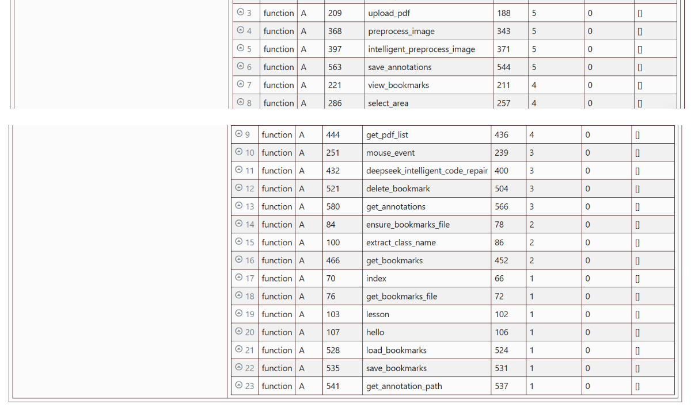
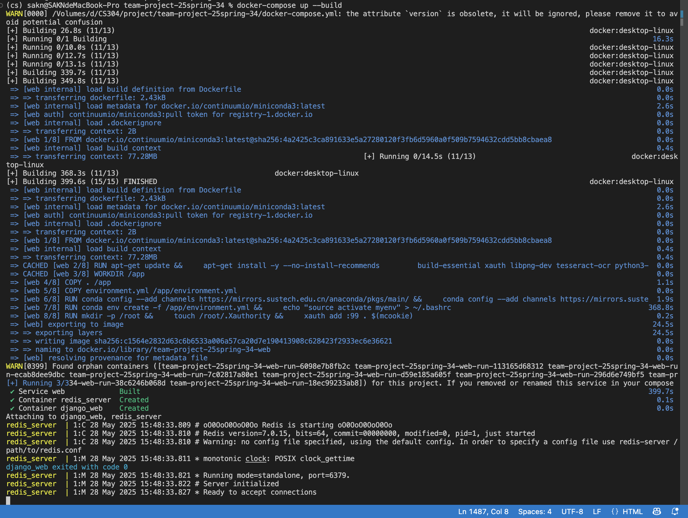
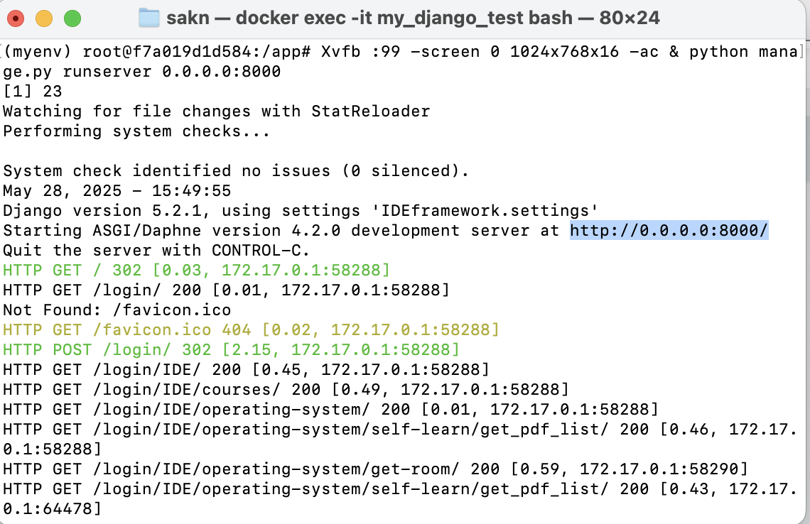

# IDEframework - 在线编程学习平台

## 1. Project Complexity

### Lines of Code

| Language | files | blank | comment | code  |
| :------: | :---: | :---: | :-----: | :---: |
|   HTML   |   8   |  723  |   63    | 5890  |
|  Python  |  53   |  587  |   667   | 2855  |
|   JSON   |   2   |   0   |    0    | 1367  |
| Markdown |   3   |  59   |    0    |  136  |
|   XML    |   7   |   0   |    0    |  86   |
|   Text   |   9   |   5   |    0    |  65   |
|   Java   |   4   |   5   |    2    |  61   |
|   SUM:   |  86   | 1379  |   732   | 10460 |


### Number of source files

102

### Cyclomatic complexity








### Number of dependencies

268

## 2.1 User Manual

### 项目简介
IDEframework 是一个基于 Django 开发的在线编程学习平台，旨在为用户提供便捷的编程学习和实践环境。该平台集成了在线 IDE、课程学习、小组协作等功能，让编程学习变得更加高效和有趣。

### 主要功能
1. **在线 IDE**
   - 支持多种编程语言的在线编辑和运行
   - 实时代码编译和错误提示
   - 代码自动补全功能(基于ai接口)

2. **课程学习**
   - 个人学习模块：自主学习和练习
   - 小组学习模块：团队协作和讨论
   - 课程进度追踪

3. **用户系统**
   - 用户注册和登录
   - 个人信息管理
   - 学习记录查看

4. **AI 助手**
   - 智能代码提示
   - 根据上传pdf生成针对性自动化评分quiz
   - 根据上传pdf生成思维导图

### 快速开始

#### 环境要求
- Python 3.8+
- Node.js 14+
- 现代浏览器（Chrome、Firefox、Safari 等）

#### 安装步骤
1. 克隆项目
```bash
git clone [项目地址]
cd team-project-25spring-34
```

2. 创建并激活虚拟环境
```bash
python -m venv .venv
# Windows
.venv\Scripts\activate
# Linux/Mac
source .venv/bin/activate
```

3. 安装依赖
```bash
pip install -r requirements.txt
npm install
```

4. 运行项目
```bash
python manage.py runserver
```

5. 访问网站
打开浏览器，访问 http://localhost:8000

### 使用指南

#### 注册和登录
1. 访问登录页面
2. 点击"注册"创建新账号
3. 填写必要信息并完成注册
4. 使用注册的账号登录系统

#### 使用在线 IDE
1. 登录后进入 IDE 页面
2. 选择编程语言
3. 在编辑器中编写代码
4. 点击运行按钮执行代码
5. 查看输出结果

#### 参与课程学习
1. 在课程列表中选择感兴趣的课程
2. 进入课程详情页
3. 按照课程进度学习
4. 完成练习和作业
5. 查看学习进度

#### 小组协作
1. 创建或加入学习小组
2. 参与小组讨论
3. 协作完成项目
4. 分享学习心得

### 常见问题
1. **Q: 代码运行出错怎么办？**
   A: 检查代码语法，查看错误提示，或使用 AI 助手获取帮助。

2. **Q: 如何创建学习小组？**
   A: 在小组学习页面点击"创建小组"，填写相关信息即可。

3. **Q: 如何删除课程？**
   A: 仅管理员有权限删除课程。

### 技术支持
如遇到问题，请通过以下方式获取帮助：
- 查看帮助文档
- 联系技术支持团队
- 在社区论坛提问

## 2.2 Developer Manual

### 项目架构

#### 技术栈
- 后端：Django 4.2
- 前端：HTML, CSS, JavaScript
- 数据库：SQLite（开发）/ MySQL（生产）
- 其他：WebSocket（用于实时通信）

#### 项目结构
```
team-project-25spring-34/
├── IDE/                  # 在线IDE应用
├── group_id/            # 小组管理应用
├── group_learn/         # 小组学习应用
├── lesson/              # 课程管理应用
├── lock_button/         # 按钮锁定功能
├── login/               # 用户认证应用
├── register/            # 用户注册应用
├── self_learn/          # 自主学习应用
├── ai_assistant/        # AI助手应用
├── utils/               # 通用工具函数
├── templates/           # HTML模板
├── static/              # 静态文件
└── media/               # 用户上传文件
```

### API 文档


#### AI Assistant API 文档

##### 1. 聊天 / 思维导图 / 出题接口

- **端点**：`/login/IDE/<data_course>/deepseek-chat/api/`
- **方法**：POST
- **说明**：  
  根据用户提供的 `message` 和可选的 PDF 文件，调用 DeepSeek API 实现三类功能：
  - 生成思维导图（Mermaid）
  - 生成测试题页面（HTML 试卷）
  - 普通文本问答

---

###### 请求参数（`multipart/form-data`）

| 参数名  | 类型   | 必填 | 说明                      |
|--------|--------|------|---------------------------|
| message | string | ✅   | 用户问题或指令 prompt      |
| pdf     | file   | ❌   | 可选上传的 PDF 文件内容     |

示例：
POST /login/IDE/cs310/deepseek-chat/api/
Content-Type: multipart/form-data

message: 请根据内容生成思维导图
pdf: <上传 PDF 文件>

---
###### 系统处理流程

1. 如有上传 PDF，则提取 PDF 文本内容；
2. 自动识别 prompt 中关键词，分类为：
   - 导图模式：含“思维导图”等关键词；
   - 测试模式：含“出题”、“小测”等关键词；
   - 否则为普通问答模式；
3. 调用 DeepSeek API 构造结果；
4. 若生成 HTML 内容：
   - 保存 HTML 文件；
   - 若是导图，调用 `html_to_png()` 截图生成 PNG；
5. 返回响应。

---

###### 响应格式

✅ 普通问答模式
```json
{
  "response": "AI 返回的文本回答"
}
```
✅ 思维导图模式
```json
{
  "response": "<a href='/media/mind_maps/mind_html_xxxx.html' target='_blank'>查看思维导图</a>",
  "html_url": "/media/mind_maps/mind_html_xxxx.html",
  "png_url": "/media/mind_pics/mind_png_xxxx.png"
}
```
✅ 测试题生成模式
```json
{
  "response": "<a href='/media/test/test_html_xxxx.html' target='_blank'>查看测试题目</a>",
  "html_url": "/media/test/test_html_xxxx.html"
}
```
❌ 错误响应示例
```json
{
  "error": "读取 PDF 失败: 文件格式错误"
}
```

##### 2. HTML 转 PNG 工具

- **函数名**：`html_to_png(html_path: str, output_png_path: str)`

- **说明**：  
  该异步函数使用 Playwright 和 Chromium 打开 HTML 文件，等待 `.mermaid svg` 元素渲染完成后，智能识别边界并裁剪保存为 PNG 图像。

- **调用示例**：

```python
await html_to_png("/path/to/file.html", "/path/to/file.png")
```

##### 3. 前端嵌入页面
- **端点**：/login/IDE/<data_course>/deepseek-chat/embed_chat/

- **方法**：GET

- **说明**：
  返回 embed.html 页面，用于嵌入式展示 AI 聊天界面。可通过 <iframe> 在其他页面中集成该功能模块。
  
#### 按钮锁定功能 API 文档

##### 1. 获取按钮状态

- **端点**：`/login/IDE/<data_course>/group-<group_id>/lock_button/get_state/`
- **方法**：GET
- **说明**：  
  获取当前按钮的锁定状态及最后操作用户。

###### 响应格式
```json
{
  "is_locked": true,
  "last_user": "user123",
  "username": "user456",
  "code": "print('Hello World')"
}
```

---

##### 2. 锁定按钮

- **端点**：`/login/IDE/<data_course>/group-<group_id>/lock_button/revise/`
- **方法**：POST
- **说明**：  
  锁定按钮并记录当前用户。

###### 响应格式
```json
{
  "username": "user123"
}
```

---

##### 3. 保存按钮状态

- **端点**：`/login/IDE/<data_course>/group-<group_id>/lock_button/save/`
- **方法**：POST
- **说明**：  
  保存按钮状态并更新代码内容。

###### 请求参数
```json
{
  "code": "print('Hello World')"
}
```

###### 响应格式
```json
{
  "username": "user123",
  "code": "print('Hello World')"
}
```

---

#### 自主学习功能 API 文档

##### 1. 上传 PDF

- **端点**：`/login/IDE/<data_course>/self-learn/upload_pdf/`
- **方法**：POST
- **说明**：  
  上传 PDF 文件并根据课程和用户名分类存储。

###### 响应格式
```json
{
  "message": "PDF 上传成功！"
}
```

---

##### 2. 删除 PDF

- **端点**：`/login/IDE/<data_course>/self-learn/delete_pdf/`
- **方法**：POST
- **说明**：  
  删除指定的 PDF 文件。

###### 请求参数
```json
{
  "pdf_name": "example.pdf"
}
```

###### 响应格式
```json
{
  "status": "success"
}
```

---

##### 3. 获取 PDF 列表

- **端点**：`/login/IDE/<data_course>/self-learn/get_pdf_list/`
- **方法**：GET
- **说明**：  
  获取当前课程和用户名下的 PDF 文件列表。

###### 响应格式
```json
{
  "pdfs": ["example1.pdf", "example2.pdf"]
}
```

---

##### 4. 运行代码

- **端点**：`/login/IDE/<data_course>/self-learn/run_code/`
- **方法**：POST
- **说明**：  
  提交代码并返回运行结果。

###### 请求参数
```json
{
  "code": "print('Hello World')"
}
```

###### 响应格式
```json
{
  "stdout": "Hello World\n",
  "stderr": ""
}
```

---

#### 小组管理功能 API 文档

##### 1. 获取小组成员

- **端点**：`/login/IDE/<data_course>/group-<group_id>/group_id/get_members/`
- **方法**：GET
- **说明**：  
  获取当前小组的成员列表。

###### 响应格式
```json
{
  "status": "success",
  "members": [
    {
      "username": "user1",
      "is_leader": true
    },
    {
      "username": "user2",
      "is_leader": false
    }
  ]
}
```

---

##### 2. 离开小组

- **端点**：`/login/IDE/<data_course>/group-<group_id>/group_id/leave_room/`
- **方法**：POST
- **说明**：  
  当前用户离开小组。

###### 响应格式
```json
{
  "status": "success",
  "message": "已成功离开房间"
}
```

---

#### 小组学习功能 API 文档

##### 1. 保存标注

- **端点**：`/login/IDE/<data_course>/group-<group_id>/group-learn/save_annotations/`
- **方法**：POST
- **说明**：  
  保存 PDF 文件的标注信息。

###### 请求参数
```json
{
  "pdf_url": "string",
  "annotations": "object"
}
```

###### 响应格式
```json
{
  "success": true,
  "created": true
}
```

---

##### 2. 获取标注

- **端点**：`/login/IDE/<data_course>/group-<group_id>/group-learn/get_annotations/`
- **方法**：GET
- **说明**：  
  获取指定 PDF 文件的标注信息。

###### 请求参数
```json
{
  "pdf_url": "string"
}
```

###### 响应格式
```json
{
  "success": true,
  "annotations": "object"
}
```

---

#### 课程管理功能 API 文档

##### 1. 创建课程

- **端点**：`/login/IDE/<data_course>/lesson/create_room/`
- **方法**：POST
- **说明**：  
  创建一个新的课程房间。

###### 请求参数
```json
{
  "room_name": "string"
}
```

###### 响应格式
```json
{
  "status": "success",
  "room_id": "string",
  "course": "string",
  "message": "房间创建成功"
}
```

---

##### 2. 获取课程房间列表

- **端点**：`/login/IDE/<data_course>/lesson/get_room_list/`
- **方法**：GET
- **说明**：  
  获取当前课程下的所有房间列表。

###### 响应格式
```json
{
  "status": "success",
  "rooms": [
    {
      "name": "room1",
      "is_creator": true,
      "is_member": true,
      "created_at": "2024-03-21 10:00"
    }
  ]
}
```


#### 登录功能 API 文档

##### 1. 用户登录

- **端点**：`/login/`
- **方法**：POST
- **说明**：  
  用户通过提交登录表单完成登录。

###### 请求参数
```json
{
  "username": "string",
  "password": "string"
}
```

###### 响应格式
✅ 成功响应
```json
{
  "status": "success",
  "message": "登录成功"
}
```

❌ 错误响应
```json
{
  "status": "error",
  "message": "用户名或密码错误"
}
```

---

#### 注册功能 API 文档

##### 1. 用户注册

- **端点**：`/register/`
- **方法**：POST
- **说明**：  
  用户通过提交注册表单完成注册。

###### 请求参数
```json
{
  "username": "string",
  "password1": "string",
  "password2": "string"
}
```

###### 响应格式
✅ 成功响应
```json
{
  "status": "success",
  "message": "注册成功"
}
```

❌ 错误响应
```json
{
  "status": "error",
  "message": "注册失败，用户名已存在"
}
```

### 开发指南

#### 环境设置
1. 克隆项目
2. 创建虚拟环境
3. 安装依赖
4. 配置数据库
5. 运行迁移
6. 启动开发服务器

#### 代码规范
- 遵循 PEP 8 规范
- 使用有意义的变量名和函数名
- 添加适当的注释
- 编写单元测试

#### 提交规范
- feat: 新功能
- fix: 修复bug
- docs: 文档更新
- style: 代码格式
- refactor: 重构
- test: 测试
- chore: 构建过程或辅助工具的变动

#### 分支管理
- main: 主分支
- develop: 开发分支
- feature/*: 功能分支
- bugfix/*: 修复分支

### 部署指南

#### 生产环境要求
- Python 3.8+
- PostgreSQL 12+
- Nginx
- Gunicorn

#### 部署步骤
1. 配置环境变量
2. 收集静态文件
3. 运行数据库迁移
4. 配置 Nginx
5. 启动 Gunicorn

### 测试指南

#### 单元测试
```bash
python manage.py test
```

#### 集成测试
```bash
python manage.py test --pattern="integration_*.py"
```

#### 性能测试
使用 Apache JMeter 进行负载测试

### 故障排除

#### 常见问题
1. 数据库连接问题
2. 静态文件服务问题
3. WebSocket 连接问题

#### 日志查看
- 应用日志：`logs/app.log`
- 错误日志：`logs/error.log`
- 访问日志：`logs/access.log`

### 贡献指南

#### 如何贡献
1. Fork 项目
2. 创建功能分支
3. 提交更改
4. 发起 Pull Request

#### 代码审查
- 确保代码符合规范
- 添加必要的测试
- 更新相关文档

### 版本历史
- v1.0.0 (2024-03-21)
  - 初始版本发布
  - 基本功能实现


## 3. Tests Manual

### 实现方法
我们使用了 Django 自带的测试框架来实现项目的自动化测试。  
具体使用的技术和方法包括：

- **unittest 和 TestCase**：我们通过继承 `django.test.TestCase` 编写测试类，能够自动创建和销毁测试数据库，使用断言方法验证功能是否正确。

- **Client() 模拟请求**：使用 Django 提供的测试客户端 `Client()` 来模拟用户请求，测试视图函数和 API 接口。

- **（可选）pytest 框架**：在部分模块中我们使用 `pytest` 来获得更强的测试结构灵活性。

- **持续测试**：通过运行 `python manage.py test` 进行持续回归测试，确保代码修改不会破坏已有功能。

- **测试覆盖率工具（如 coverage.py）**：评估测试对代码逻辑的覆盖情况。

### Source Code for Testing

自动测试的源代码可在以下位置获得：

- **IDE Tests**：https://github.com/sustech-cs304/team-project-25spring-34/blob/main/IDE/tests.py
- **AI Assistant Tests**：https://github.com/sustech-cs304/team-project-25spring-34/blob/main/ai_assistant/tests.py
- **Button Lock Tests**：https://github.com/sustech-cs304/team-project-25spring-34/blob/main/button_lock/tests.py
- **Group ID Tests**：https://github.com/sustech-cs304/team-project-25spring-34/blob/main/group_id/tests.py
- **Group Learn Tests**：https://github.com/sustech-cs304/team-project-25spring-34/blob/main/group_learn/tests.py
- **Lesson Tests**：https://github.com/sustech-cs304/team-project-25spring-34/blob/main/lesson/tests.py
- **Login Tests**：https://github.com/sustech-cs304/team-project-25spring-34/blob/main/login/tests.py
- **Register Tests**：https://github.com/sustech-cs304/team-project-25spring-34/blob/main/register/tests.py
- **Self Learn Tests**：https://github.com/sustech-cs304/team-project-25spring-34/blob/main/self_learn/tests.py

这些文件包含使用Django的测试框架实现的单元和集成测试。

### 测试效果评估

我们的测试对系统核心功能具有较好的覆盖效果。我们为 IDE 模块（如代码执行、文件处理）和 AI 助手模块（如 PDF 解析、回答生成）编写了单元测试和集成测试。这些测试验证了后端逻辑、输入处理和边界情况，能够有效检测潜在错误。

我们使用 Django 的 `TestCase` 和 `Client()` 模拟 HTTP 请求和数据库交互。实际运行结果表明大部分接口功能正确，未发现严重错误。

但由于 **Group Learn 模块的聊天功能依赖 WebSocket 和异步消息机制**，目前 Django 自带测试框架难以模拟这类实时通信，因此暂未进行自动化测试。我们通过多用户角色和多个浏览器实例的**手动测试**方式对该功能进行了验证。

尽管我们未生成形式上的覆盖率报告（如使用 `coverage.py`），但测试集中在关键路径，能提供较高的系统正确性保障。

## 4. Build

### ✅ Technologies/Tools/Frameworks Used

- **Python + pip**：用于后端依赖安装，管理 `requirements.txt`。
- **npm + Node.js**：用于构建前端模块。
- **Django 管理命令**：执行数据库迁移、收集静态文件等。
- **Docker & Docker Compose**：在构建时打包项目代码和依赖。
- **GitHub**：作为代码管理平台。

### ✅ Build Tasks

- 安装后端依赖：`pip install -r requirements.txt`
- 安装前端依赖：`npm install`
- 构建前端静态资源：`npm run build`
- Django 数据库迁移：`python manage.py migrate`
- 收集静态文件：`python manage.py collectstatic --noinput`
- 运行自动测试：`python manage.py test`

### ✅ Artifacts Produced

- 编译后的前端静态资源（位于 `src/main/webapp/dist`）
- 完整的 Django 后端服务（含数据库 schema）
- 可运行的 Docker 镜像，用于部署服务

### 📄 Build Scripts

- [requirements.txt](https://github.com/sustech-cs304/team-project-25spring-34/blob/main/requirements.txt)
- [package.json](https://github.com/sustech-cs304/team-project-25spring-34/blob/main/src/main/webapp/package.json)
- [Dockerfile](https://github.com/sustech-cs304/team-project-25spring-34/blob/main/Dockerfile)
- [docker-compose.yml](https://github.com/sustech-cs304/team-project-25spring-34/blob/main/docker-compose.yml)

---

## 5. Deployment

### ✅ Containerization Technologies Used

- **Docker**：用于打包后端、前端及其依赖。
- **Docker Compose**：管理多服务部署（构建镜像、运行容器等）。

### 📜 Deployment Approach

我们采用了 Docker 进行一键式容器化部署。具体步骤如下：

1. 构建镜像（包含后端和前端）：

   ```bash
   docker-compose up --build
   ```
2. 启动容器
   ```bash
   docker run -dit --name my_django_test -p 8000:8000 team-project-25spring-34-web tail -f /dev/null
   ```
3. 进入容器安装依赖
   ```bash
   docker exec -it my_django_test bash
   pip install tools frontend
   ```
4. 启动 Django 服务（注意关闭科学上网以保证 Xvfb 可用）
   ```bash
   Xvfb :99 -screen 0 1024x768x16 -ac & python manage.py runserver 0.0.0.0:8000
   ```
5. 浏览器访问终端输出的网址即可进入系统
   
### 🧾 Scripts and Files Used
   - Dockerfile
   - docker-compose.yml

### ✅ Proof of Successful Build
截图终端中的 Successfully built 输出或 docker images 结果：



